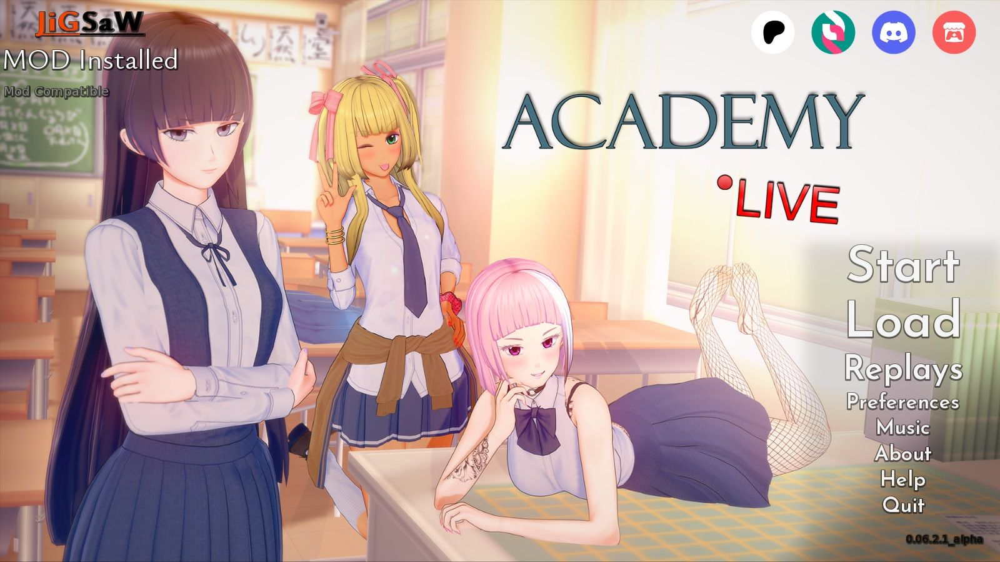

I have created a Multi-Mod with walkthrough for Academy Live! by [passhonQ](https://www.patreon.com/passhonQ)

Mod Features:
  1. Custom Cheat menu to Edit a few items
  2. Walkthough with Suggestions.
  3. Customizable Quick Menu Position
  4. Custom Music Player with In-Game Overlay using In-Game Music
  5. In-Game Mod shortcuts button "?" Just above Music Player Overlay
  6. Toggle between standard Notifications of Stack Notifications
  7. Fadeable text with options to change to suit you preference
  8. Custom Savenames
  9. Hotkeys for choice menus

Every option can be toggled in preferences

Have tested that if you remove mod saves still work even if a save was made while the mod was installed.

The mod works without modifying any of the original files so theoretically it should not affect saves.

The way passhonQ develops the walkthrough would need to be updated on every release.

The other options should work without a hitch but will be tested on every release.

Drop the contents into game folder

If the mod is installed correctly it will show on the main menu mod installed

The Current Mod Version is **0.06.2.1_alpha**
